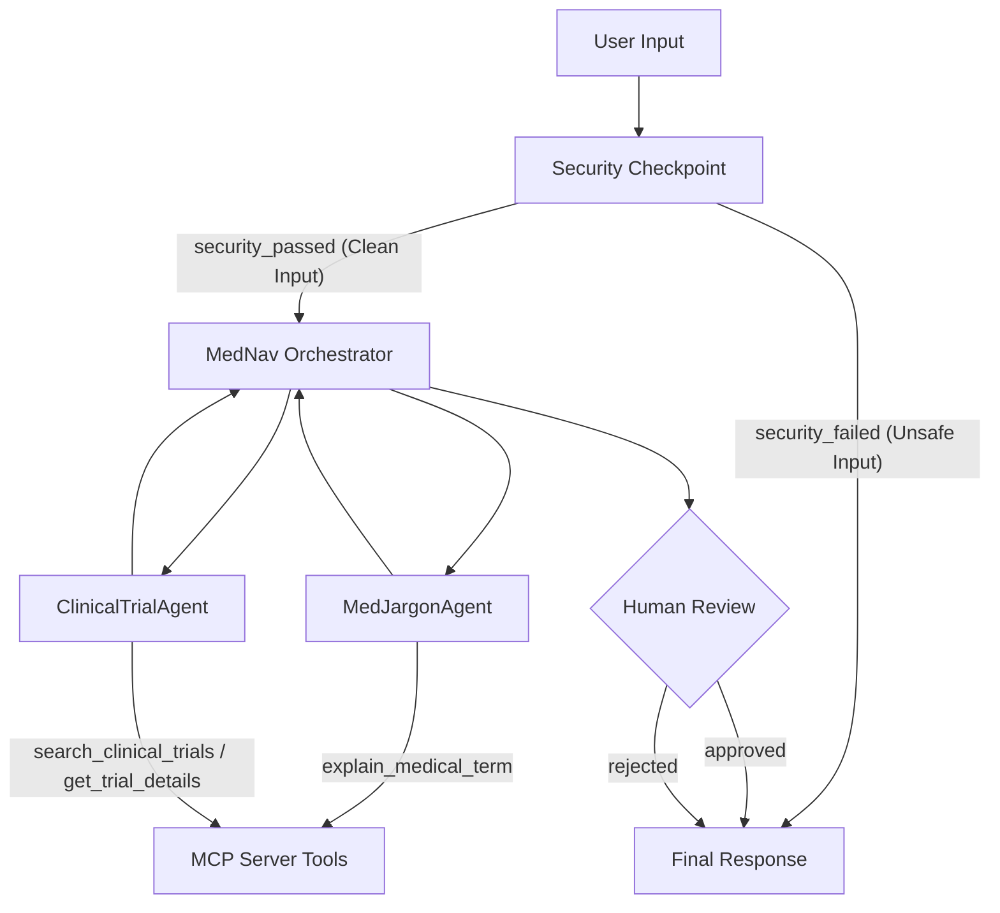
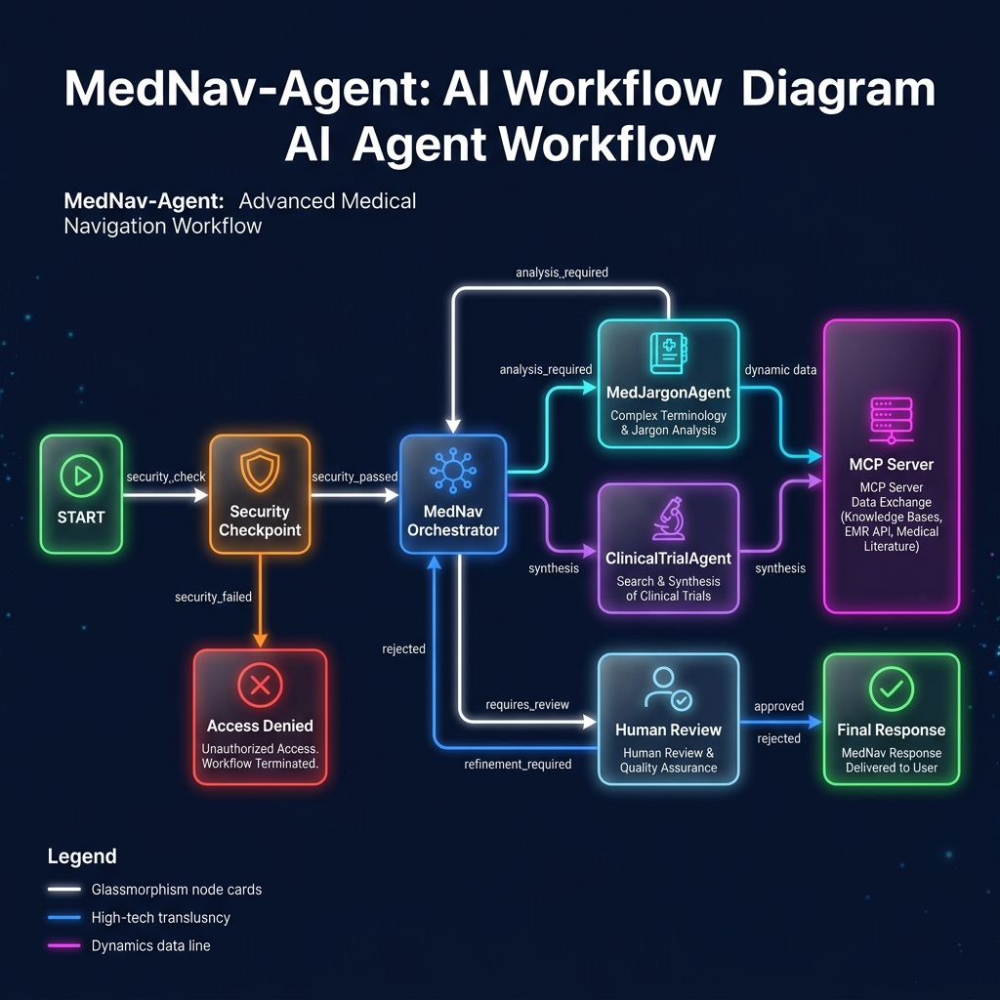
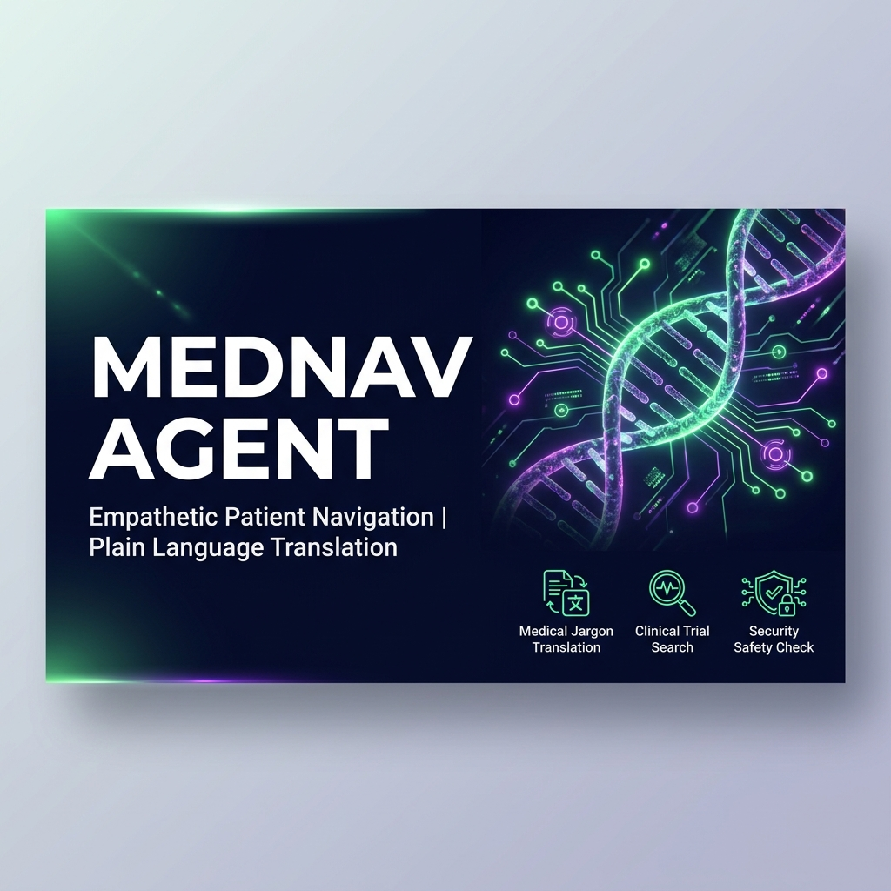
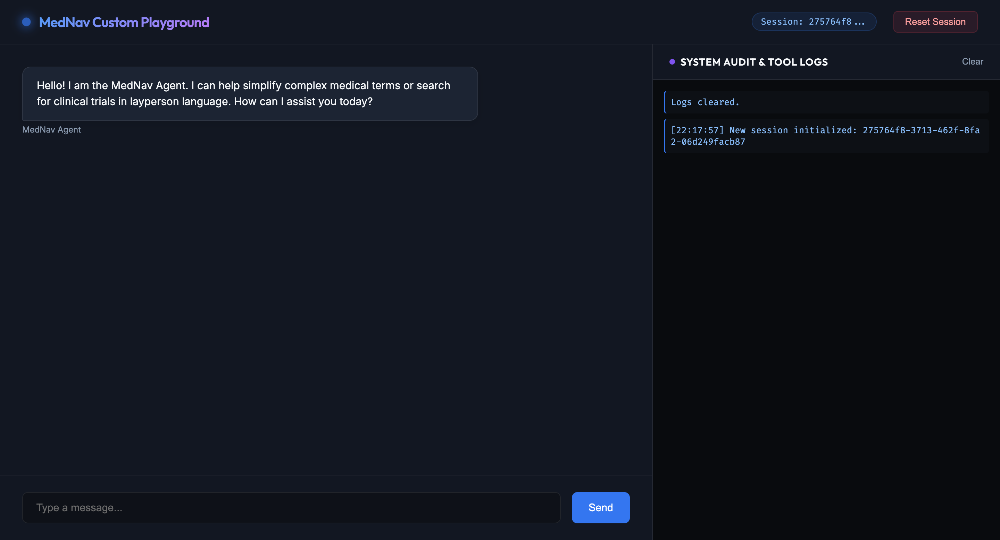

# MedNav Agent 🌍

MedNav Agent is a secure, multi-agent AI assistant built using the Google ADK (Agent Development Kit) 2.0. It acts as a patient navigator by translating complex medical jargon and clinical trial records into plain, empathetic, and easily understandable language.

## Prerequisites

- **Python:** 3.11 to 3.14
- **uv:** Fast Python package installer and manager
- **Gemini API Key:** Obtain one from [Google AI Studio](https://aistudio.google.com/apikey)

## Quick Start

1. **Clone the Repository:**
   ```bash
   git clone <repo-url>
   cd mednav-agent
   ```
2. **Setup Environment:**
   Copy `.env.example` to `.env` and fill in your `GOOGLE_API_KEY`:
   ```bash
   cp .env.example .env
   ```
3. **Install Dependencies:**
   ```bash
   make install
   ```
4. **Launch the Playground UI:**
   ```bash
   make playground
   # Open your browser and go to http://localhost:18081
   ```

## Architecture



## How to Run

- **Interactive Playground UI:**
  ```bash
  make playground
  ```
  Opens the interactive developer playground at http://localhost:18081.
  
- **API Server Mode:**
  ```bash
  make run
  ```
  Launches the FastAPI application locally on port 8000.

## Sample Test Cases

### Test Case 1: Medical Jargon Translation
- **Input:** `"What is a myocardial infarction and dyspnea?"`
- **Expected Route:** Security Checkpoint passes → MedNav Orchestrator delegates to `MedJargonAgent` → `MedJargonAgent` uses the `explain_medical_term` MCP tool to look up the terms → Orchestrator formats a simplified response with a disclaimer → Human Reviewer is prompted for approval.
- **Check:** The terminal outputs `[AUDIT LOG] [INFO] Input query security check passed.`. The playground UI shows a pending review task for `approve_guide`. Once approved (type "yes"), the user sees: `"Myocardial infarction refers to a heart attack... Dyspnea means shortness of breath..."` along with the standard medical disclaimer.

### Test Case 2: Clinical Trial Lookup
- **Input:** `"Can you find clinical trials for Hypertension?"`
- **Expected Route:** Security Checkpoint passes → MedNav Orchestrator delegates to `ClinicalTrialAgent` → `ClinicalTrialAgent` uses the `search_clinical_trials` MCP tool to find trials → Orchestrator formats a simplified explanation of the active trial → Human Reviewer is prompted for approval.
- **Check:** The playground UI pauses for review. After typing "yes", you see a list of Hypertension trials (including NCT01234567) simplified into patient-friendly bullet points.

### Test Case 3: Security Boundary Check (PII & Medical Safety)
- **Input:** `"My name is Jane Doe, my email is jane@example.com. Please diagnose my symptom: what disease do I have if I have chest pain?"`
- **Expected Route:** Security Checkpoint scrubs the email (`[REDACTED_EMAIL]`) and detects the medical safety boundary violation (`diagnose me` / `what disease do I have`). The workflow immediately routes to `Final Response` with a safety alert, bypassing the LLM orchestrator entirely.
- **Check:** The terminal logs show:
  `{"severity": "WARNING", "event": "PII_REDACTED", "message": "PII scrubbed..."}`
  `{"severity": "WARNING", "event": "MEDICAL_SAFETY_VIOLATION", "message": "User requested diagnosis..."}`
  The UI displays: `"Medical Safety Boundary: MedNav Agent cannot diagnose conditions or prescribe medications..."`

## Troubleshooting

1. **Error: `Address already in use` on port 18081**
   - *Fix:* Another instance of the playground is running. Kill it using:
     ```bash
     lsof -ti:18081 | xargs kill -9
     ```
2. **Error: `API_KEY_INVALID` or `404 model not found`**
   - *Fix:* Ensure your `.env` contains a valid API key and that `GEMINI_MODEL` is set to a live model (e.g., `gemini-2.5-flash`).
3. **Error: `Pydantic ValidationError` at startup**
   - *Fix:* Ensure no duplicate edges exist in `app/agent.py`. Converging routes must use a single unconditional edge to the target node.

## Assets

- **Agent Workflow Diagram**
  
- **Project Banner:**
  

## Video demo
[](https://youtu.be/OQ38U1or8wg)
