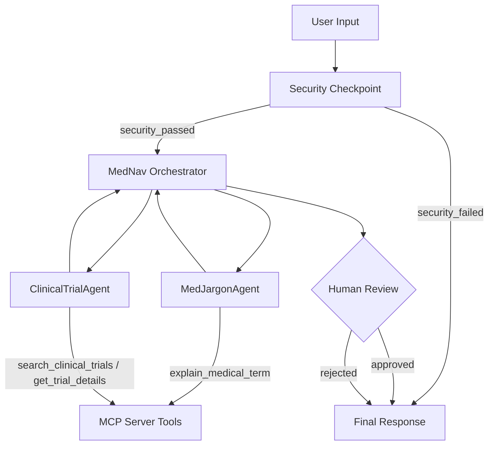

# MedNav Agent — Submission Write-Up 🌍

## Problem Statement

Navigating the healthcare system is notoriously challenging for patients, particularly when confronted with complex medical jargon and dense clinical trial documentations. Patients often struggle to understand their diagnoses, the meanings of terms, or what is required to enroll in clinical trials. This knowledge gap can lead to anxiety, confusion, and missed opportunities for receiving advanced care. 

**MedNav Agent** is designed to address this problem. It acts as an empathetic, plain-language patient navigator that translates complex medical terminology and clinical trial records into friendly, clear, and easy-to-understand explanations.

## Solution Architecture

The system utilizes an ADK 2.0 multi-agent workflow graph to process the user query securely and efficiently:

---

## Concepts Used

- **ADK 2.0 Workflow Graph:** Graph-based topology built with function nodes and edges in [app/agent.py](file:///Users/busha/Documents/google_x_kaggle/adk-workspace-2/mednav-agent/app/agent.py).
- **LlmAgent:** Specialized sub-agents (`MedJargonAgent` and `ClinicalTrialAgent`) defined in [app/agent.py](file:///Users/busha/Documents/google_x_kaggle/adk-workspace-2/mednav-agent/app/agent.py).
- **AgentTool:** Used by the main `mednav_orchestrator` in [app/agent.py](file:///Users/busha/Documents/google_x_kaggle/adk-workspace-2/mednav-agent/app/agent.py) to delegate tasks to the specialized sub-agents.
- **MCP Server:** Local stdio MCP server exposing domain-specific tools, written in [app/mcp_server.py](file:///Users/busha/Documents/google_x_kaggle/adk-workspace-2/mednav-agent/app/mcp_server.py).
- **Security Checkpoint:** Pre-processing function node in [app/agent.py](file:///Users/busha/Documents/google_x_kaggle/adk-workspace-2/mednav-agent/app/agent.py) that performs input validation, PII scrubbing, and medical safety checks.
- **Agents CLI:** Scaffolding, environment setup, and local development playground using `agents-cli`.

---

## Security Design

Medical applications require strict security and boundary controls:
1. **PII Scrubbing:** The `security_checkpoint` uses regular expressions to detect and redact sensitive patient details (Emails, Phone numbers, Social Security Numbers, and Medical Record Numbers) before they are sent to the LLM. This prevents data leaks.
2. **Prompt Injection Mitigation:** Key prompt injection patterns (such as "ignore previous instructions") are detected, and the workflow is aborted if found.
3. **Medical Safety Boundary:** To prevent the AI from giving diagnostic advice or prescribing treatments, any query containing terms like "diagnose me" or "prescribe" is flagged, and the request is rejected with a standard medical disclaimer.
4. **Structured JSON Audit Logs:** All security decisions (INFO, WARNING, and CRITICAL) are logged as structured JSON objects for auditing and monitoring.

---

## MCP Server Design

The local stdio Model Context Protocol (MCP) server in [app/mcp_server.py](file:///Users/busha/Documents/google_x_kaggle/adk-workspace-2/mednav-agent/app/mcp_server.py) exposes the following tools:
1. `explain_medical_term(term)`: Looks up a medical term in a glossary and returns a clear, non-jargon definition.
2. `search_clinical_trials(query)`: Queries a local clinical trials database for trials matching a condition or keyword.
3. `get_trial_details(nct_id)`: Fetches detailed enrollment criteria, description, and status for a specific trial.

---

## Human-in-the-Loop (HITL) Flow

A `human_review` node in the workflow graph acts as an approval gate before the generated guide is presented to the patient. It yields a `RequestInput` with the generated guide. A medical reviewer or administrator must review the text and type `yes` to approve or `no` to reject it. This ensures that no misleading or inaccurate information is shown to the patient.

---

## Demo Walkthrough

1. **Jargon Translation:** User asks about "myocardial infarction". The agent uses `explain_medical_term` to get "heart attack" and generates a simplified explanation.
2. **Clinical Trial Inquiry:** User asks for trials on "Hypertension". The agent uses `search_clinical_trials` and returns the matching trial along with its phase, status, and simplified eligibility criteria.
3. **Security Check:** User includes an email address and asks the agent to "diagnose me". The agent redacts the email, flags the safety violation, and returns a refusal message without calling the LLM.

---

## Impact / Value Statement

MedNav Agent bridges the communication gap between healthcare providers, clinical researchers, and patients. By transforming intimidating clinical trial pages and medical terminology into simple, reassuring text, it empowers patients to make informed decisions about their care, increases enrollment in clinical trials, and reduces patient anxiety.
